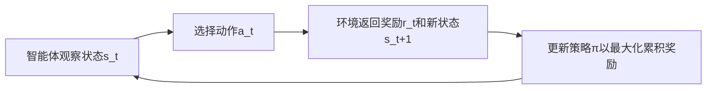
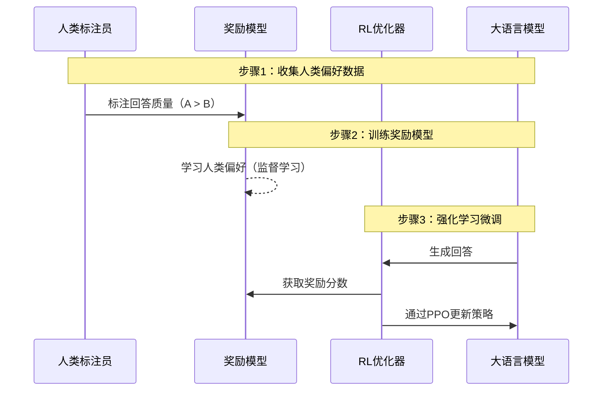

**强化学习（Reinforcement Learning, RL）** 与 **模型微调（Fine-Tuning）** 是两种不同的机器学习范式，但在大模型（如ChatGPT）优化中常结合使用。以下是系统解析：

---

### **一、强化学习（RL）的本质**
#### **核心定义**
> 智能体（Agent）通过与环境（Environment）交互，根据**奖励信号（Reward）** 学习最优策略（Policy），以最大化长期累积奖励。

#### **关键要素**
| **要素**        | **说明**                  | **示例**                     |
|-----------------|--------------------------|-----------------------------|
| **智能体 (Agent)** | 决策主体                 | 游戏AI、机器人控制系统        |
| **环境 (Environment)** | 外部世界               | 游戏规则、物理仿真环境        |
| **状态 (State)**   | 环境当前信息             | 棋盘布局、传感器数据          |
| **动作 (Action)**  | 智能体的行为选择         | 移动棋子、调整电机转速        |
| **奖励 (Reward)**  | 动作的即时反馈（标量值） | 获胜+1分，碰撞-10分          |

#### **训练流程**

---

### **二、模型微调的本质**
#### **核心定义**
> 在预训练模型（如BERT、GPT）基础上，**用目标领域数据调整模型参数**，使其适应新任务。

#### **典型场景**
- **NLP**：BERT用于情感分类  
- **CV**：ImageNet预训练模型用于医学影像分割  
- **关键操作**：冻结底层参数 + 重构并训练顶层分类器

---

### **三、强化学习与模型微调的关系**
二者在 **大模型对齐（Alignment）** 中深度融合，典型技术为 **RLHF（Reinforcement Learning from Human Feedback）**：

#### **RLHF 工作流程**

#### **关键结合点**
1. **微调提供基础能力**  
   - 初始模型通过监督微调（SFT）学会任务基本响应能力。

2. **强化学习优化对齐**  
   - 基于奖励模型（RM）的反馈，用RL（如PPO算法）微调模型，使其输出更符合人类偏好：
     - 更**无害**（拒绝非法请求）
     - 更**有帮助**（提供详实信息）
     - 更**拟人化**（自然对话风格）

---

### **四、强化学习微调 vs. 传统微调**
| **维度**         | **强化学习微调 (RLHF)**        | **传统监督微调 (SFT)**         |
|------------------|-------------------------------|-------------------------------|
| **优化目标**     | 最大化奖励函数（不可导）       | 最小化交叉熵损失（可导）        |
| **训练数据**     | 人类偏好（A/B回答对比）        | 标注输入-输出对                |
| **风险**         | 可能过度优化奖励导致退化        | 受限于标注数据质量             |
| **计算成本**     | 高（需多次策略迭代）           | 中等                           |
| **典型应用**     | ChatGPT、Claude 对齐           | BERT下游任务适配               |

---

### **五、强化学习独立应用的场景**
即使不结合微调，RL也广泛用于：
1. **游戏AI**  
   - AlphaGo（围棋）、AlphaStar（星际争霸）  
2. **机器人控制**  
   - 机械臂抓取、自动驾驶决策  
3. **资源调度**  
   - 数据中心能耗优化、推荐系统实时调整  

---

### **六、为什么RLHF需要预训练微调？**
1. **冷启动问题**  
   - 纯RL从随机策略开始训练大模型效率极低（需数十亿次交互）。  
2. **奖励稀疏性**  
   - 直接使用人类反馈作为奖励频率太低（人类标注速度<<环境交互速度）。  
3. **安全底线保障**  
   - 预训练模型已具备基础能力，避免RL探索产生灾难性输出。

---

### **总结**
- **强化学习（RL）**：通过奖励机制学习决策策略，擅长优化**不可导目标**（如人类偏好）。  
- **模型微调**：基于梯度下降适配新任务，依赖**标注数据集**。  
- **二者关系**：  
  - **独立时**：解决不同问题（RL→决策，微调→领域迁移）。  
  - **结合时（RLHF）**：微调提供基础能力，RL实现人类价值观对齐，是大模型安全落地的核心技术。  

> 注：RLHF已成为ChatGPT、Claude等对话系统的标配，使模型从“能力强大但不可控”进化为“有用且安全的AI助手”。