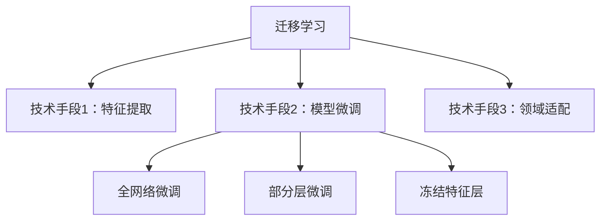

**迁移学习（Transfer Learning）** 与 **模型微调（Fine-Tuning）** 是深度学习中的核心概念，二者紧密关联但各有侧重。以下是系统解析：

---

### **一、迁移学习（Transfer Learning）**
#### **定义**  
将从一个任务（**源域**）学到的知识迁移到另一个相关任务（**目标域**），提升目标任务的性能和学习效率。

#### **核心思想**  
- **知识复用**：利用预训练模型学到的通用特征（如边缘、纹理、语义模式）。  
- **领域适配**：通过调整使源域知识适应目标域。

#### **适用场景**  
1. **目标域数据少**（如医疗影像仅有100张标注图）。  
2. **目标域与源域相关**（如ImageNet预训练模型用于动物分类）。  
3. **训练资源有限**：避免从零训练大模型。

#### **典型流程**  

---

### **二、模型微调（Fine-Tuning）**  
#### **定义**  
在预训练模型基础上，**用目标域数据调整模型参数**，使其适配新任务。  
**本质**：迁移学习的一种**技术实现手段**。

#### **关键操作**  
1. **参数初始化**：加载预训练权重（如ResNet在ImageNet上的权重）。  
2. **分层调整**：  
   - **特征提取层**：小幅调整或冻结（保留通用特征）。  
   - **分类/输出层**：完全重构并训练（适配新任务类别）。

#### **微调策略**  
| **策略**          | 操作方式                     | 适用场景                     |
|-------------------|----------------------------|----------------------------|
| **全网络微调**    | 调整所有权重                 | 目标域数据充足，与源域差异大 |
| **部分层微调**    | 仅调整顶层（如最后3层）       | 目标域数据较少               |
| **冻结特征层**    | 固定底层权重，仅训练分类头    | 数据极少，避免过拟合         |

---

### **三、迁移学习 vs. 微调：区别与联系**  
| **维度**         | **迁移学习**                  | **模型微调**                  | **关系说明**                     |
|------------------|------------------------------|------------------------------|----------------------------------|
| **范畴**         | 宏观方法论                    | 具体技术手段                  | 微调是迁移学习的子集             |
| **实现方式**     | 包含特征提取、微调、适配器等   | 特指参数调整                  | 微调是最常用的迁移方法           |
| **知识复用形式** | 特征/模型结构/参数迁移         | 仅参数迁移                    | 微调是参数迁移的核心技术         |

#### **关系图解**  

---

### **四、实例说明：NLP中的BERT微调**  
1. **源域任务**：预训练BERT（MLM + NSP任务，学习语言通用表示）。  
2. **目标域任务**：情感分类（如IMDB影评分类）。  
3. **微调操作**：  
   - 保留BERT的Transformer层权重（复用语言知识）。  
   - 替换顶部的MLM分类头为情感分类头（二分类层）。  
   - 用IMDB数据调整**所有层**的参数（全网络微调）。  

---

### **五、迁移学习的其他技术（非微调）**  
1. **特征提取（Feature Extraction）**：  
   - 冻结预训练模型，仅用其输出特征训练新分类器。  
   - 例：用ResNet提取图像特征 → SVM分类。  
2. **领域对抗训练（DANN）**：  
   - 添加领域分类器，使特征分布对齐源域和目标域。  
3. **提示学习（Prompt Tuning）**：  
   - 调整输入提示（Prompt）激活预训练知识，冻结模型参数。

---

### **六、如何选择迁移策略？**  
| **场景**                          | **推荐策略**               | **原因**                     |
|-----------------------------------|---------------------------|------------------------------|
| 目标数据极少（<100样本）          | 冻结特征层 + 训练分类头     | 避免过拟合                   |
| 目标数据充足（>1万样本）          | 全网络微调                 | 充分适配新任务               |
| 目标域与源域差异极大（如医学影像） | 领域对抗训练 + 微调         | 缓解分布差异                 |

---

### **总结**  
- **迁移学习**：广义的“知识迁移”范式，包含多种技术。  
- **模型微调**：通过调整预训练模型参数实现迁移，是其中最高效的主流方法。  
- **核心价值**：**降低数据需求**、**加速训练**、**提升小样本任务性能**。  

在实践中，90%的迁移学习通过微调实现，掌握分层调整策略（冻结/解冻）是关键技能。